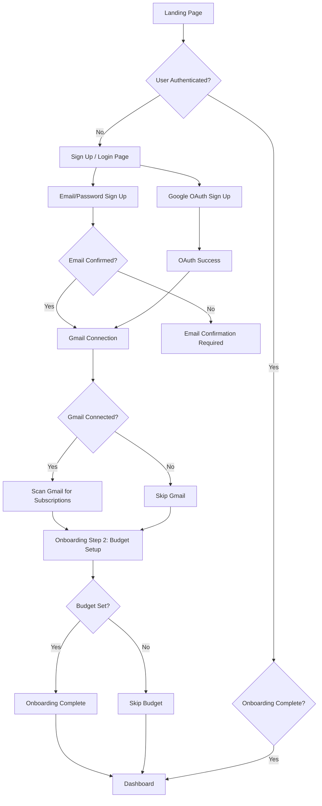
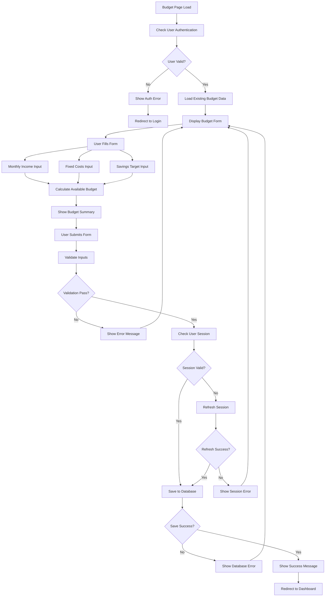
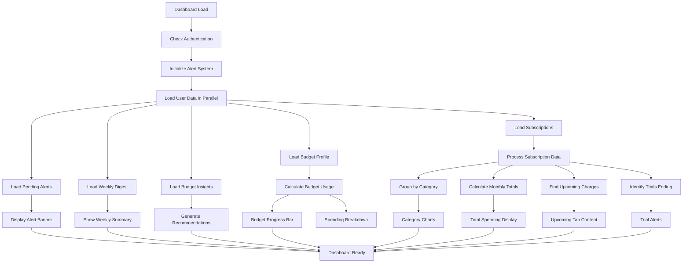
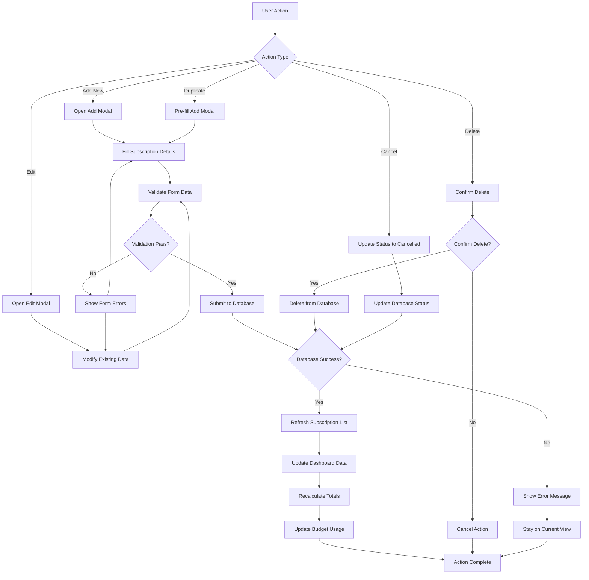
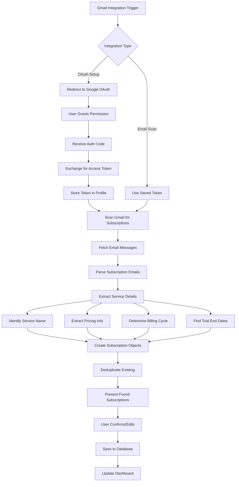
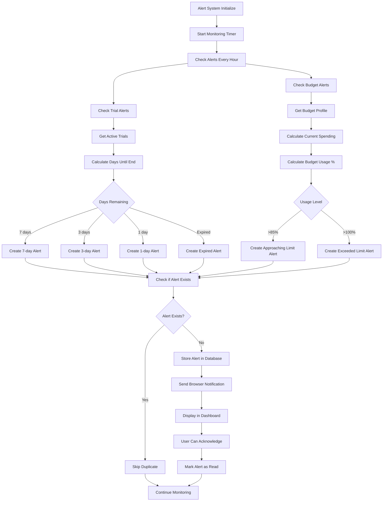
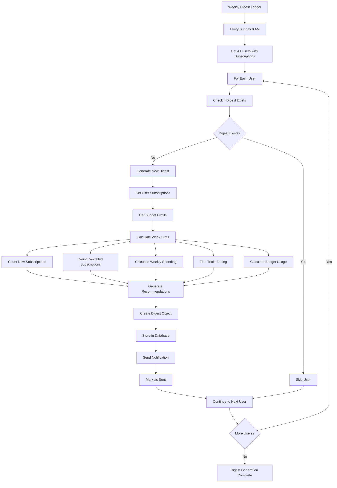
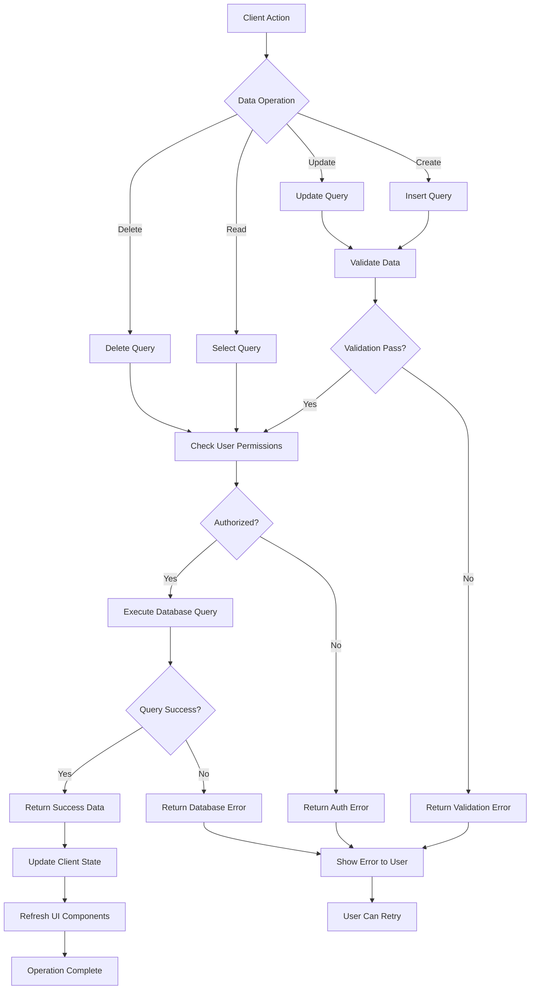
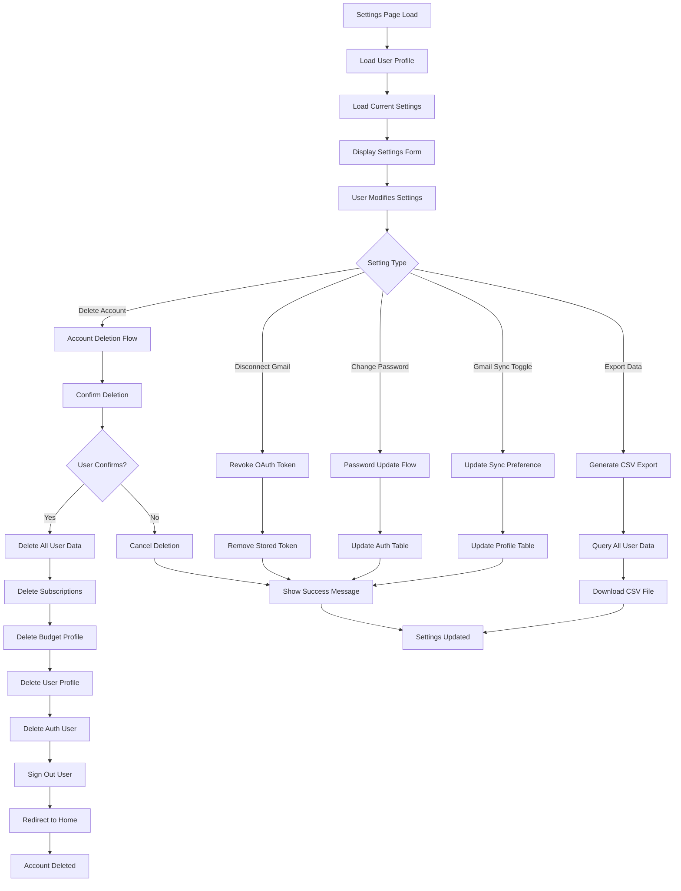
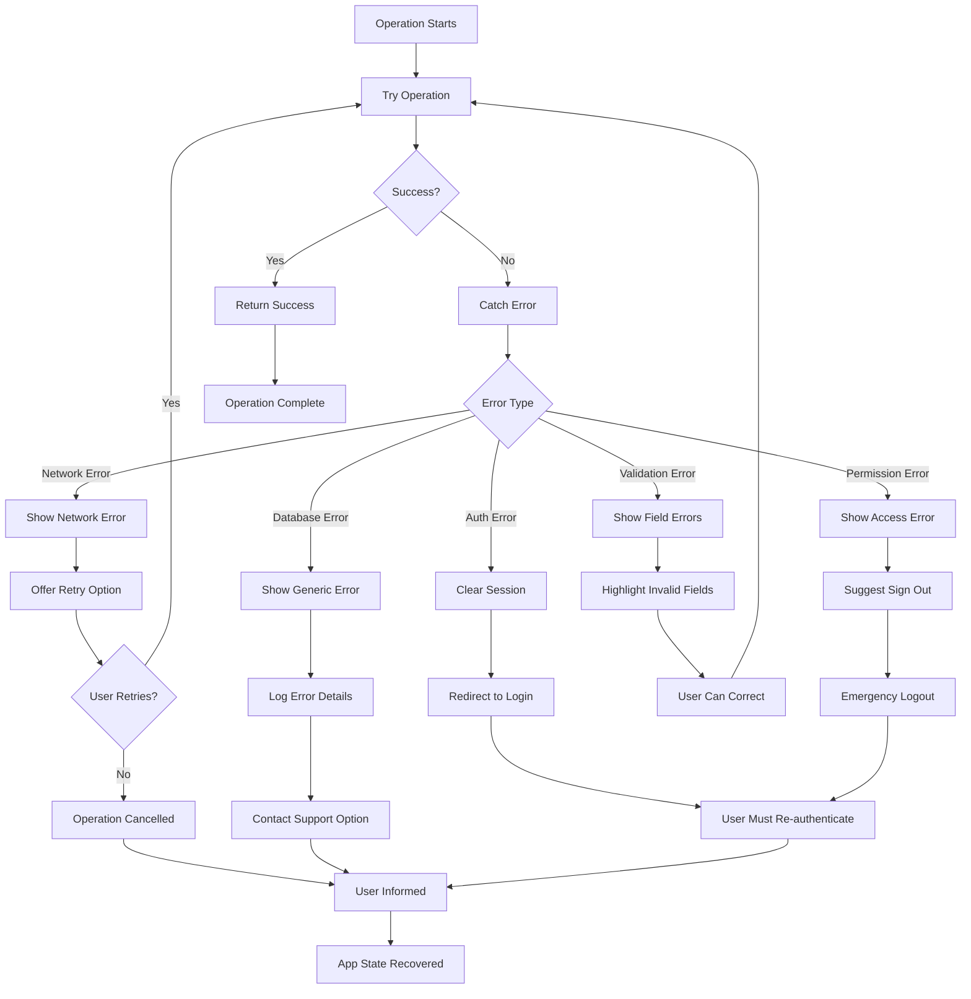

# SubTracker Flow Diagrams

## 1. User Authentication & Onboarding Flow

## 2. Budget Setup Flow (Budget.tsx)

## 3. Dashboard Data Loading Flow

## 4. Subscription Management Flow

## 5. Gmail Integration Flow

## 6. Alert System Flow

## 7. Weekly Digest Generation Flow

## 8. Data Persistence Layer

## 9. Settings & Preferences Flow

## 10. Error Handling & Recovery Flow

These flow diagrams illustrate the key interactions in your SubTracker application, showing how data flows between the UI components, business logic, and database layers. Each diagram focuses on a specific aspect of the application while showing the decision points, error handling, and user experience flows.
