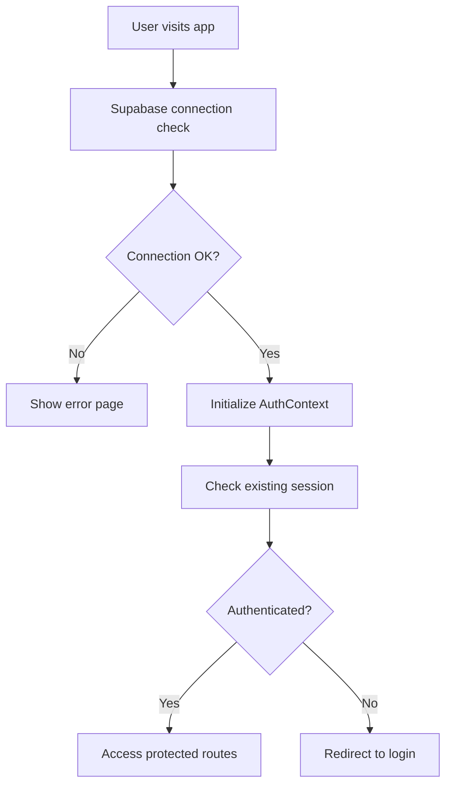

# Supabase Integration Setup

This document outlines the complete Supabase integration for SubTracker, including authentication, database configuration, and testing setup.

## 🚀 Quick Start

### 1. Environment Setup

1. Copy the example environment file:
   ```bash
   cp .env.local.example .env.local
   ```

2. Get your Supabase credentials from [app.supabase.com](https://app.supabase.com):
   - Go to your project dashboard
   - Navigate to Settings → API
   - Copy your Project URL and anon/public key

3. Update `.env.local` with your values:
   ```env
   VITE_PUBLIC_SUPABASE_URL=https://your-project-id.supabase.co
   VITE_PUBLIC_SUPABASE_ANON_KEY=your-anon-key-here
   ```

### 2. Test Configuration

For running E2E tests, create a separate Supabase project for testing:

1. Create a new project in Supabase for testing
2. Update `.env.test` with your test project credentials
3. Run tests with proper environment isolation

## 🏗️ Architecture Overview

### Authentication Flow



### File Structure

```
src/
├── lib/
│   ├── supabase.ts          # Supabase client configuration
│   └── auth.ts              # Authentication helper functions
├── contexts/
│   └── AuthContext.tsx      # Global auth state management
├── components/
│   └── ProtectedRoute.tsx   # Route protection components
└── pages/
    ├── Login.tsx            # Login page
    ├── SignUp.tsx           # Registration page
    └── Dashboard.tsx        # Protected dashboard
```

## 🔧 Configuration Files

### supabase.ts
- Supabase client initialization
- Environment variable validation
- Development debugging features
- Connection testing utilities

### auth.ts
- Authentication helper functions
- Error handling and type safety
- Password reset functionality
- Session management utilities

### AuthContext.tsx
- Global authentication state
- React hooks for auth operations
- Real-time auth state updates
- Loading and error states

## 🛡️ Security Features

### Environment Variable Validation
- Checks for required Supabase credentials
- Provides clear error messages for missing config
- Prevents app startup with invalid configuration

### Authentication Protection
- Route-level protection with ProtectedRoute
- Email confirmation requirements
- Session validation and refresh
- Automatic redirects for auth states

### Error Handling
- Graceful error handling for all auth operations
- User-friendly error messages
- Development debugging information
- Fallback states for connection issues

## 🧪 Testing Integration

### Global Setup
- Automatic Supabase connection testing
- Test user creation and management
- Environment isolation for tests
- Pre-test validation checks

### Test Environment
- Separate Supabase project for testing
- Isolated test data and users
- Playwright configuration with data-testid selectors
- Automated test user setup

## 🚨 Troubleshooting

### Common Issues

#### "Invalid API key" Error
- Check your VITE_PUBLIC_SUPABASE_ANON_KEY in .env.local
- Ensure the key is for the correct project
- Verify the key has the correct permissions

#### "Failed to connect" Error
- Verify your VITE_PUBLIC_SUPABASE_URL is correct
- Check your internet connection
- Ensure Supabase project is active

#### "Email confirmation required" Message
- Check the user's email for confirmation link
- Verify email confirmation is enabled in Supabase
- Check spam/junk folders

### Debug Mode

Enable debug mode in development:
```env
VITE_DEBUG_SUPABASE=true
```

This provides:
- Console logging for auth events
- Global `window.supabase` access
- Detailed error information
- Connection status logging

## 📊 Monitoring

### Authentication Events
The app logs all authentication events:
- Sign in/out events
- Session refresh
- Token validation
- Connection status

### Development Tools
With debug mode enabled:
- Access Supabase client via `window.supabase`
- View real-time auth state changes
- Monitor session status
- Test authentication functions

## 🔄 Deployment

### Production Checklist
- [ ] Set production Supabase credentials
- [ ] Disable debug mode (`VITE_DEBUG_SUPABASE=false`)
- [ ] Configure proper redirect URLs in Supabase
- [ ] Set up email templates in Supabase
- [ ] Test authentication flow in production

### Environment Variables
Required for production:
```env
VITE_PUBLIC_SUPABASE_URL=your-production-url
VITE_PUBLIC_SUPABASE_ANON_KEY=your-production-key
VITE_APP_NAME=SubTracker
VITE_APP_URL=https://your-domain.com
```

## 📚 Additional Resources

- [Supabase Documentation](https://supabase.com/docs)
- [React Authentication Guide](https://supabase.com/docs/guides/auth/auth-helpers/react)
- [Supabase Security Best Practices](https://supabase.com/docs/guides/auth/security)
- [Testing with Supabase](https://supabase.com/docs/guides/testing)

## 🤝 Support

If you encounter issues with the Supabase integration:

1. Check the troubleshooting section above
2. Review the Supabase project logs
3. Enable debug mode for detailed logging
4. Check the browser console for errors
5. Verify environment variable configuration
